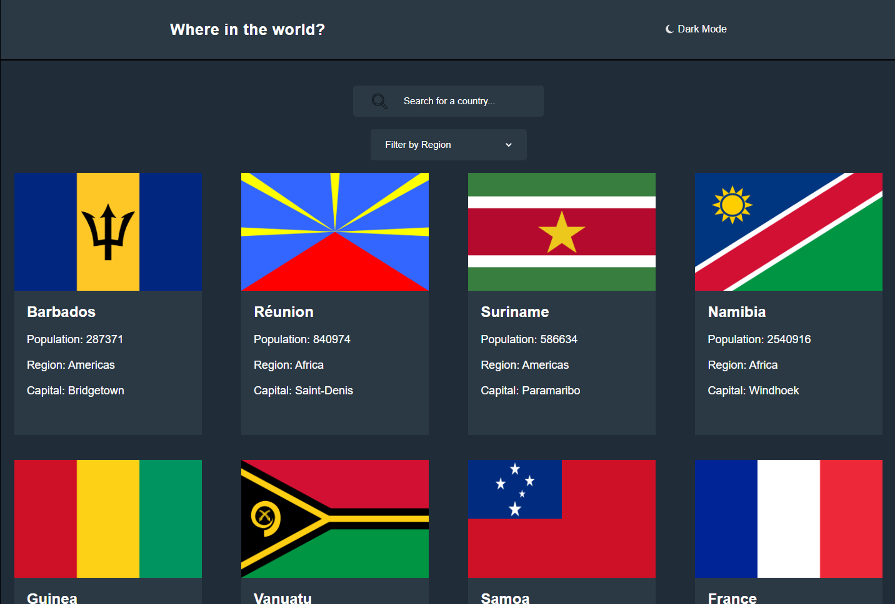

## Proyecto: REST Countries

## Sobre este proyecto:

#### ✔️ Desafío realizado gracias a la plataforma [Frontend Mentor](https://www.frontendmentor.io).

#### ✔️ Creado con HTML, CSS y JavaScript.

#### ✔️ Consumo de la API de [Rest Countries](https://restcountries.com).

#### ✔️ Responsive.

### Mi aprendizaje 🚀

* Fortalecer el entendimiento de nodos y la manipulación de los mismos. (crear elementos, borrar y agregar clases, etc.)
* Perfeccionar el uso de operaciones asíncronas. (Async & Await)
* Desestructuración de objetos.
* Repaso de eventos.
